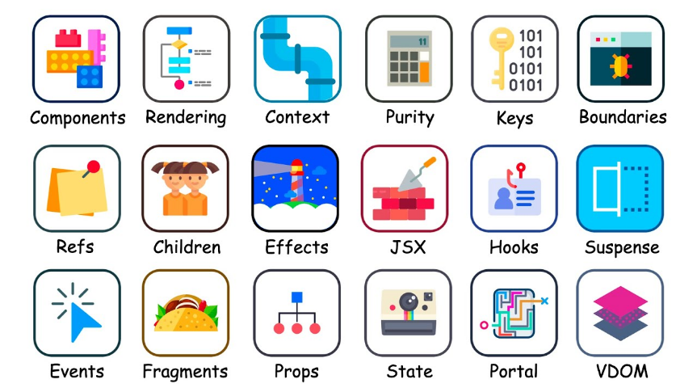
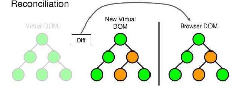
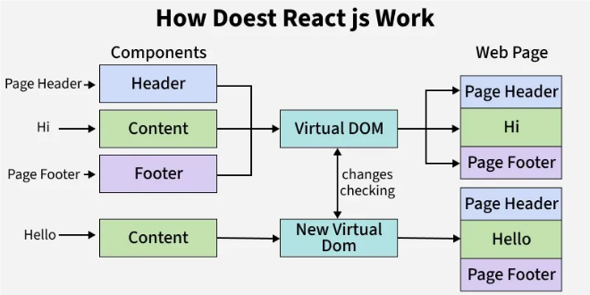
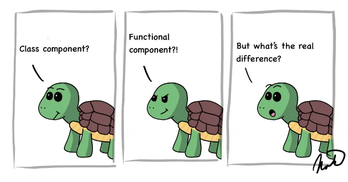
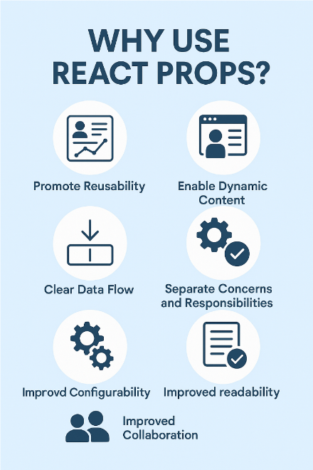
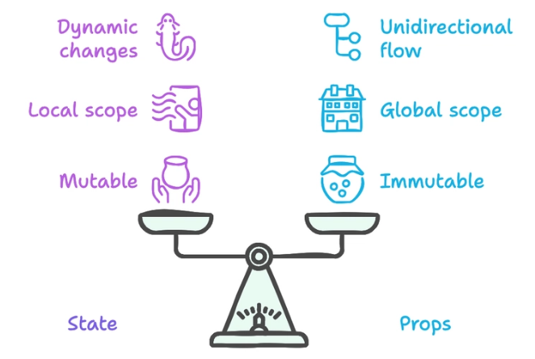
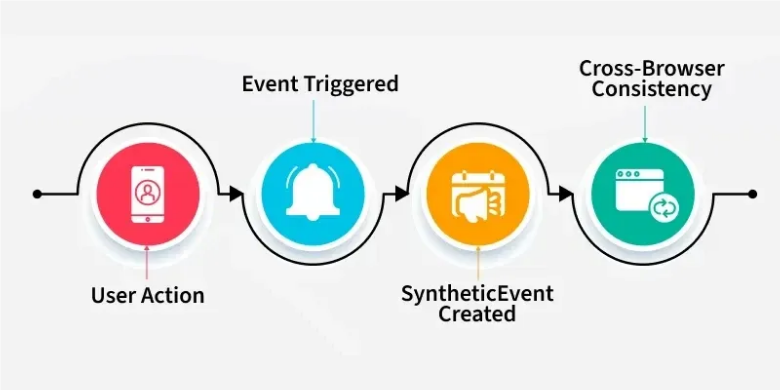
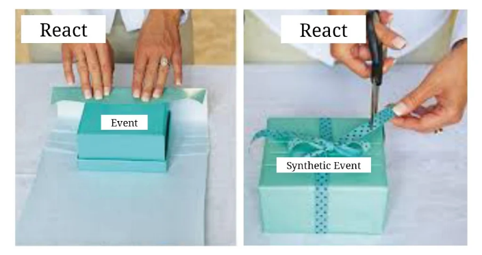
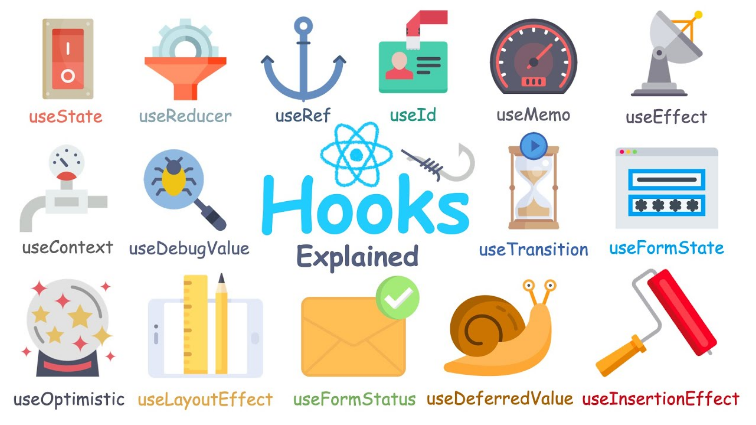

<hr style="border: 2px solid green;">


## 1. React Basics

* [What is React?](#What_is_React)
* [Why is React used?](#Why_is_React_used)
* [What are the main features of React?](#main_features_of_React)
* [What is JSX?](#What_is_JSX)
* [Why JSX is faster than normal JavaScript?](#JSX_faster_than_normal)
* [What is Virtual DOM?](#What_is_Virtual_DOM)
* [Difference between Virtual DOM and Real DOM](#Virtual_DOM_and_Real_DOM)
* [How React works internally?](#How_React_works_internally)
* [What is Reconciliation,why Reconciliation is needed?](#What_is_Reconciliation)

---

## 2. Components

* [What is a component in React?](#What_is_a_Component_in_React)
* [Difference between Functional and Class components](#Functional_and_Class_components)
* [What is component composition?](#Component_Composition)
* [Why Functional components are preferred now?](#Functional_Components)
* [What is component reusability?](#What_is_component_reusability)
* [What is a pure component?](#What_is_a_pure_component)
* [What is Shallow Comparison?](#What_is_Shallow_Comparison?)
* [What is memoized component?](#What_is_a_Memoized_Component)

---

## 3. Props

* [What are props?](#Props_in_React)
* [Are props mutable or immutable?](#Are_Props_Mutable_or_Immutable)
* [Difference between props and state](#Difference_between_props_and_state)
* [How to pass data from parent to child?](#pass_data_from_parent_to_child)
* [How to pass data from child to parent?](#pass_data_from_child_to_parent)
* [What is prop drilling. How to avoid prop drilling?](#What_is_prop_drilling)

---

## 4. State
* [What is state in React?](#What_is_State_in_React)
* [Why state is needed?](#Why_State_is_Needed_in_React)
* [How to update state correctly?](#Update_State_Correctly)
* [Why state updates are asynchronous?](#state_updates_are_asynchronous)
* [How to manage multiple states?](#Manage_Multiple_States_in_React)

---

## 5. Events

* [What is Event Handling?](What_is_Event_Handling)
* [How event handling works in React?](#Event_Handling_Works)
* [Difference between React events and DOM events](#between_React_Events_and_DOM_Events)
* [What is synthetic event?](#What_is_a_Synthetic_Event)
* [How to pass arguments to event handlers?](#pass_arguments_to_event_handlers)
* [How to prevent default behavior in React?](#Prevent_Default_Behavior_in_React)

---


## 6. Conditional Rendering

* [What is conditional rendering?](#Conditional_Rendering)

---

## 7. Lists & Keys

* [How to render lists in React?](#Render_Lists_in_React)
* Why keys are important?
* What happens if keys are not used?
* [Why index as key is not recommended?](#index_is_not_a_key)
* How React uses keys internally?

---

## 8. Hooks 

* [What are hooks?](#Hooks_in_React)
* [Why hooks were introduced?](#Why_hooks_were_introduced)
* [Rules of hooks](#Rules_of_Hooks)

---


## 9. Hooks (Detailed)

### Basic Hooks

* [What is `useState` and Why is used?](#What_is_useState)
* [What is `useEffect` and why is used?](#What_is_useEffect)
* [Cleanup function in `useEffect`](#Cleanup_Function_in_useEffect)
* [Dependency Array Behavior in useEffect](#Dependency_Array_Behavior)

### Context Hook

* [What is `useContext`?](What_is_useContext)
* [What problem does `useContext` solve?](#What_problem_does_useContext)

### Ref Hook

* [What is `useRef` and why is used?](#What_is_useRef)
* [Difference between `useRef` and `useState`](#Difference_between_useRef_and_useState)

### Memoization Hooks

* [What is `useMemo` and why is used?](#What_is_useMemo)
* [What is `useCallback` and why is used?](#What_is_useCallback)
* [Difference between `useMemo` and `useCallback`](#Difference_between_useMemo_and_useCallback)

### Reducer Hook

* [What is `useReducer`and why is used?](#What_is_useReducer)
* [Difference between `useReducer` and `useState`](#Difference_between_useReducer_and_useState)

### Layout & DOM Hooks

* [What is `useLayoutEffect`?](#What_is_useLayoutEffect)
* [Difference between `useEffect` and `useLayoutEffect`](#between_useEffect_and_useLayoutEffect)

### Advanced Hooks

* What is `useImperativeHandle` and why is used?
* What is `useDebugValue` and why is used?

### Concurrent Hooks

* What is `useTransition` and why is used?
* What is `useDeferredValue` and why is used?

### Utility Hook

* What is `useId` and Why `useId` is used?

### Custom Hooks

* [What is a custom hook and Why custom hooks are created and When to create custom hooks?](#What_is_a_Custom_Hook)


---

---

<h1 style="text-align:center;" > React Basics</h1>



<hr style="border: 2px solid green;">

<h2 id="What_is_React" style="color:green; text-align:center;">⚛️ What is React?</h2>

 **React** is a **JavaScript library** used to build **user interfaces**, mainly for **single-page applications**.

* It helps you create **reusable UI components**
* It updates the screen **fast** using a virtual DOM
* It is maintained by **Meta (Facebook)**

---

📌 **Query-style answer:**

**React makes building interactive and dynamic websites easier and faster.**


<hr style="border: 2px solid green;">

<h2 id="Why_is_React_used" style="color:green; text-align:center;"> 🚀 Why is React used? </h2>


- **Fast performance** – Uses **Virtual DOM** to update only changed parts
- **Reusable components** – Write once, use anywhere
- **Easy to manage UI** – UI updates automatically when data changes
- **Large community** – Lots of support, libraries, and tools
- **Used by big companies** – Facebook, Instagram, Netflix, etc.

---

📌 **Query-style answer:**

**React is used to build fast, scalable, and interactive user interfaces easily.**


<hr style="border: 2px solid green;">

<h2 id="main_features_of_React" style="color:green; text-align:center;"> ✨ Main features of React? </h2>


* **Component-Based** – UI is built using small, reusable components
* **Virtual DOM** – Improves performance by updating only necessary parts
* **JSX** – Write HTML-like code inside JavaScript
* **One-Way Data Binding** – Data flows in one direction, easy to debug
* **Fast Rendering** – Quick UI updates
* **Strong Community Support** – Backed by Meta and large ecosystem

---

📌 **Query-style answer:**

**React helps build fast, reusable, and easy-to-manage user interfaces.**


<hr style="border: 2px solid green;">

<h2 id="What_is_JSX" style="color:green; text-align:center;"> What is JSX? </h2>


🧠 **JSX (JavaScript XML)** is a **syntax extension** used in React that allows us to write **HTML-like code inside JavaScript**.

  - Makes code **easy to read and write**
  - Used to describe **UI structure**
  - Compiled into normal JavaScript by Babel

📌 Example idea:
HTML + JavaScript together in one place

---

📌 **Query-style answer:**

**JSX lets you write UI code in a simple and readable way inside JavaScript.**


<hr style="border: 2px solid green;">

<h2 id="JSX_faster_than_normal" style="color:green; text-align:center;"> ⚡ Why is JSX faster than normal JavaScript? </h2>


✅ **JSX is not actually faster by itself**

👉 JSX is converted into **JavaScript** by Babel

🚀 **Real reason for speed in React:**
* **Virtual DOM** – Updates only changed elements
* **Efficient diffing algorithm** – Finds minimum changes
* **Optimized rendering** – Reduces direct DOM manipulation

📌 JSX helps React **understand UI structure clearly**, which makes updates **more efficient**.

---

📌 **Query-style answer:**

**JSX feels faster because React optimizes UI updates, not because JSX is faster than JavaScript.**


<hr style="border: 2px solid green;">

<h2 id="What_is_Virtual_DOM" style="color:green; text-align:center;"> 🧠 What is Virtual DOM? </h2>



🌳 **Virtual DOM** is a **lightweight copy of the real DOM** used by React.

* React first updates the **Virtual DOM**
* It compares old and new Virtual DOM (**diffing**)
* Finds only the **changed parts**
* Updates **only those parts** in the real DOM

🚀 This makes React **fast and efficient**.

---

📌 **Query-style answer:**

**Virtual DOM helps React update the UI quickly by changing only what is needed.**


<hr style="border: 2px solid green;">

<h2 id="Virtual_DOM_and_Real_DOM" style="color:green; text-align:center;"> 🆚 Difference between Virtual DOM and Real DOM </h2>


| * Virtual DOM                  | 🔸 Real DOM                    |
| ------------------------------ | ----------------------------- |
| 🧠 Lightweight copy of Real DOM | 🌐 Actual browser DOM          |
| ⚡ Faster updates               | 🐌 Slower updates              |
| 🔄 Updates only changed parts   | 🔁 Re-renders full DOM nodes   |
| 💻 Stored in memory             | 🌍 Directly affects browser UI |
| 🚀 Used by React                | 🧩 Used by normal JavaScript   |

---

📌 **Query-style answer:**

**Virtual DOM is faster because it updates only required changes, while Real DOM updates everything.**


<hr style="border: 2px solid green;">

<h2 id="How_React_works_internally" style="color:green; text-align:center;"> ⚙️ How React works internally? </h2>




* **Component creation** – You write UI as components
* **JSX compilation** – JSX is converted into JavaScript
* **Virtual DOM creation** – React creates a Virtual DOM tree
* **State / props change** – Data changes trigger re-render
* **Diffing (Reconciliation)** – React compares old vs new Virtual DOM
* **Efficient update** – Only changed parts update in Real DOM

🚀 This process makes React **fast and efficient**.

---

📌 **Query-style answer:**

**React updates only what changes instead of reloading the whole page.**


<hr style="border: 2px solid green;">

<h2 id="What_is_Reconciliation" style="color:green; text-align:center;"> What is Reconciliation,why Reconciliation is needed? </h2>

**Reconciliation** is the process React uses to **update the UI efficiently** when the **state or props change**.

🧠 In simple words:

> React compares the **old Virtual DOM** with the **new Virtual DOM** and updates **only the changed parts** in the real DOM.

---

### 🔍 Why is Reconciliation needed?

⚡ **Performance**

* Updating the whole DOM is slow
* Reconciliation updates **only what changed**

🪄 **Efficiency**

* React uses a **diffing algorithm** to find differences
* Less DOM manipulation = faster app

🧱 **Better User Experience**

* Faster rendering
* Smooth UI updates

---

### 🧩 How it works (Easy Steps)

1️⃣ State or props change
2️⃣ New **Virtual DOM** is created
3️⃣ React compares it with the old one 🔍
4️⃣ Only changed elements are updated in the real DOM 🎯

---

### 🗣 Interview One-Line Answer (Very Important ⭐)

> **Reconciliation is the process by which React updates the DOM by comparing the old and new Virtual DOM and applying only the necessary changes for better performance.**


<hr style="border: 2px solid green;">


<h1 style="text-align:center;" > Components </h1>


<hr style="border: 2px solid green;">

<h2 id="What_is_a_Component_in_React" style="color:green; text-align:center;"> 🧩 What is a Component in React? </h2>

📦 A **component** is a **small, reusable piece of UI** in React.

* Components can be **buttons, forms, headers, pages**, etc.

* Each component has its **own logic and UI**

* Components can be **reused** multiple times

📌 Example idea:
One website = many small components

---

📌 **Query-style answer:**

**A component is a reusable building block of the React UI.**


<hr style="border: 2px solid green;">

<h2 id="Functional_and_Class_components" style="color:green; text-align:center;"> 🆚 Difference between Functional and Class Components
 </h2>




| * Functional Component                 | 🔸 Class Component            |
| -------------------------------------- | ---------------------------- |
| 🧩 Simple JavaScript function           | 🏗️ JavaScript class           |
| ⚛️ Uses **Hooks** (useState, useEffect) | 🔁 Uses **lifecycle methods** |
| ✍️ Less code, easy to read              | 📄 More code, complex         |
| 🚀 Better performance                   | 🐌 Slightly slower            |
| ✅ Most used in modern React            | ❌ Less used now              |

---

📌 **Query-style answer:**

**Functional components are simpler and preferred over class components in modern React.**


<hr style="border: 2px solid green;">

<h2 id="Component_Composition" style="color:green; text-align:center;"> What is Component Composition? </h2>


🧱 **Component composition** means **building components by combining other components**.

* One component can **contain** other components
* Helps create **clean, reusable, and flexible UI**
* Avoids code duplication

📌 Example idea:
Page = Header + Sidebar + Content + Footer

---

📌 **Query-style answer:**

**Component composition is creating complex UI by joining small components together.**


```jsx
function Header() {
  return <h1>My Website</h1>;
}

function Footer() {
  return <p>© 2025</p>;
}

function Page() {
  return (
    <div>
      <Header />
      <p>Welcome to my website</p>
      <Footer />
    </div>
  );
}
```

* **Header** and **Footer** are small components
* **Page** component **uses (composes)** them together

---

📌 **Query-style answer:**

**Using components inside another component is called component composition.**

<hr style="border: 2px solid green;">
<h2 id="Functional_Components" style="color:green; text-align:center;"> ⭐ Why Functional Components are Preferred Now? ⚛️ </h2>


Functional components are preferred because they are **simpler, faster, and easier to manage** using **React Hooks**.

- **Less Code & More Readable** – No classes, constructors, or `this` keyword
- **Hooks Support 🪝** – Use `useState`, `useEffect`, etc. for state and lifecycle
- **Better Performance ⚡** – Easier for React to optimize
- **Reusable Logic ♻️** – Custom Hooks make logic sharing simple

---

### **💻 Code Sample**

```jsx
import React, { useState } from "react";

function Counter() {
  const [count, setCount] = useState(0);

  return (
    <button onClick={() => setCount(count + 1)}>
      Count: {count}
    </button>
  );
}

export default Counter;
```

---

### **🎯 Interview One-Line Answer**

> **Functional components are preferred because they are simpler, use hooks for state and lifecycle management, and provide better performance and code readability.**
<hr style="border: 2px solid green;">

<h2 id="What_is_component_reusability" style="color:green; text-align:center;"> 🔁 What is Component Reusability in React? ♻️</h2>


**Component Reusability** means **creating a component once and using it multiple times** with different data (props).

- **Saves Development Time ⏱️**
- **Reduces Code Duplication 🧹**
- **Easy to Maintain & Update 🔧**
- **Makes UI Consistent 🎨**

---

### **💻 Code Sample**

```jsx
function Button({ text }) {
  return <button>{text}</button>;
}

// Reusing the same component
<Button text="Login" />
<Button text="Register" />
```

---

### **🎯 Interview One-Line Answer**

> **Component reusability allows the same React component to be used multiple times with different props, reducing duplication and improving maintainability.**

<hr style="border: 2px solid green;">

<h2 id="What_is_a_pure_component" style="color:green; text-align:center;"> ✨ What is a Pure Component? ⚛️</h2>

A **Pure Component** is a React component that **re-renders only when its props or state change**.

🔹 Uses **shallow comparison 🧠** of props and state
🔹 Prevents **unnecessary re-renders 🚫**
🔹 Improves **performance ⚡**

---

### **💻 Code Sample (Class-based Pure Component)**

```jsx
import React, { PureComponent } from "react";

class MyComponent extends PureComponent {
  render() {
    return <h1>Hello React</h1>;
  }
}

export default MyComponent;
```

---

### **🪝 Functional Alternative (Using React.memo)**

```jsx
const MyComponent = React.memo(() => {
  return <h1>Hello React</h1>;
});
```

---

### **🎯 Interview One-Line Answer**

> **A Pure Component automatically performs a shallow comparison of props and state to avoid unnecessary re-rendering and improve performance.**

<hr style="border: 2px solid green;">

<h2 id="What_is_Shallow_Comparison" style="color:green; text-align:center;"> 🔍 What is Shallow Comparison? 🧠</h2>

**Shallow comparison** checks **only the first level of values** in objects or arrays, **not nested data**.

- Compares **primitive values directly** (`number`, `string`, `boolean`)
- For objects & arrays, compares **reference (memory address)**
- Faster but **does not detect deep changes ⚠️**

---

### **💻 Example**

```js
const obj1 = { name: "React" };
const obj2 = { name: "React" };

console.log(obj1 === obj2); // false (different reference)
```

```js
const obj3 = obj1;
console.log(obj1 === obj3); // true (same reference)
```

---

### **⚛️ In React Context**

- Used by **PureComponent** and **React.memo**
- If reference doesn’t change → **no re-render 🚫**
- If reference changes → **re-render happens 🔄**

---

### **🎯 Interview One-Line Answer**

> **Shallow comparison compares only top-level values and checks object or array references instead of deeply comparing nested data.**


<hr style="border: 2px solid green;">

<h2 id="What_is_a_Memoized_Component" style="color:green; text-align:center;"> 🧠 What is a Memoized Component? ⚛️ </h2>


A **Memoized Component** is a React component that **re-renders only when its props change**, using **memoization**.

-  Created using **`React.memo()` 🪝**
-  Prevents **unnecessary re-renders 🚫**
-  Uses **shallow comparison 🔍** of props
-  Improves **performance ⚡**

---

### **💻 Code Sample**

```jsx
const UserName = React.memo(({ name }) => {
  return <h2>{name}</h2>;
});

export default UserName;
```

---

### **🎯 Interview One-Line Answer**

> **A memoized component uses `React.memo` to remember the previous output and re-render only when its props change.**

<hr style="border: 2px solid green;">

<h1 style="text-align:center;" > Props </h1>



<hr style="border: 2px solid green;">

<h2 id="Props_in_React" style="color:green; text-align:center;"> What are Props in React? </h2>

📦 **Props (Properties)** are used to **pass data from one component to another**.

* Data flows **from parent to child**
* Props are **read-only** (cannot be changed by child)
* Used to make components **dynamic and reusable**

📌 Example idea:
Same button, different text

---

📌 **Query-style answer:**

**Props are inputs that allow components to receive data from their parent.**

```jsx
function Welcome(props) {
  return <h1>Hello {props.name}</h1>;
}

function App() {
  return <Welcome name="React" />;
}
```

* `name` is a **prop**
* Data is passed from **App → Welcome**
* `Welcome` uses the value but **cannot change it**

---

📌 **Query-style answer:**

**Props are used to pass data from parent component to child component.**


<hr style="border: 2px solid green;">

<h2 id="Are_Props_Mutable_or_Immutable" style="color:green; text-align:center;"> 🧩 Are Props Mutable or Immutable?
 </h2>

❌ **Props are immutable** (cannot be changed by the child component)

* Props are **read-only**
* Only the **parent component** can change them

### ✅ Example

```jsx
function Child(props) {
  // ❌ Wrong (cannot change props)
  // props.name = "New Name";

  return <h1>Hello {props.name}</h1>;
}

function Parent() {
  return <Child name="React" />;
}
```

📌 Even if you try to change `props.name`, React **does not allow it**.

---

📌 **Query-style answer:**

**Props cannot be modified by the component that receives them.**


<hr style="border: 2px solid green;">

<h2 id="Difference_between_props_and_state" style="color:green; text-align:center;"> Difference between props and state </h2>



🆚 **Difference between Props and State**

| * Props                                      | 🔸 State                             |
| -------------------------------------------- | ----------------------------------- |
| 📦 Used to pass data to components            | 🧠 Used to manage component data     |
| ⬇️ Data comes from parent                     | 🔁 Data is managed inside component  |
| ❌ Immutable (read-only)                      | ✅ Mutable (can be changed)          |
| ⚛️ Used in both functional & class components | ⚛️ Mostly used inside components     |
| 🔄 Changes come from parent                   | 🔄 Changes using setState / useState |

---

📌 **Query-style answer:**

**Props are used to pass data, while state is used to manage data inside a component.**


<hr style="border: 2px solid green;">

<h2 id="pass_data_from_parent_to_child" style="color:green; text-align:center;"> How to pass data from parent to child? </h2>

🧩 **How to Pass Data from Parent to Child?**

👉 Data is passed using **props**

### ✅ Simple Example

```jsx
function Parent() {
  return <Child name="React" />;
}

function Child(props) {
  return <h2>Hello {props.name}</h2>;
}

```

* `Parent` sends data using `name`
* `Child` receives data using `props.name`

---

📌 **Query-style answer:**

**Data is passed from parent to child using props.**


<hr style="border: 2px solid green;">

<h2 id="pass_data_from_child_to_parent" style="color:green; text-align:center;"> 🧩 How to Pass Data from Child to Parent? </h2>

👉 By using a **function passed as a prop**

### ✅ Simple Example

```jsx
function Child(props) {
  return (
    <button onClick={() => props.sendData("Hello Parent")}>
      Send Data
    </button>
  );
}

function Parent() {
  const getData = (msg) => {
    console.log(msg);
  };

  return <Child sendData={getData} />;
}
```

* Parent passes a **function** to Child
* Child **calls the function** with data
* Parent receives the data

---

📌 **Query-style answer:**

**Data is passed from child to parent using callback functions via props.**


<hr style="border: 2px solid green;">

<h2 id="What_is_prop_drilling" style="color:green; text-align:center;"> 🧩 What is Prop Drilling? and How to Avoid Prop Drilling? </h2>


📦 **Prop drilling** means **passing props through multiple components** even when intermediate components don’t need them.

* Data goes: Parent → Child → Grandchild
* Makes code **hard to manage**

### ❌ Prop Drilling Example

```jsx
function Parent() {
  return <Child name="React" />;
}

function Child({ name }) {
  return <GrandChild name={name} />;
}

function GrandChild({ name }) {
  return <h1>Hello {name}</h1>;
}
```

---

### 🚫 How to Avoid Prop Drilling?

👉 Use **Context API**

### ✅ Simple Context Example

```jsx
import { createContext, useContext } from "react";

const NameContext = createContext();

function Parent() {
  return (
    <NameContext.Provider value="React">
      <Child />
    </NameContext.Provider>
  );
}

function Child() {
  return <GrandChild />;
}

function GrandChild() {
  const name = useContext(NameContext);
  return <h1>Hello {name}</h1>;
}
```

---

📌 **Query-style answer:**

**Prop drilling is passing data through many components. It can be avoided using Context API.**


<h1 style="text-align:center;" > State </h1>

<hr style="border: 2px solid green;">

<h2 id="What_is_State_in_React" style="color:green; text-align:center;"> 🧩 What is State in React?</h2>


🧠 **State** is used to **store and manage data inside a component**.


* State can **change over time**

* When state changes, **UI re-renders**

* State is **local to the component**

---

### ✅ Simple Example

```jsx
import { useState } from "react";

function Counter() {
  const [count, setCount] = useState(0);

  return (
    <button onClick={() => setCount(count + 1)}>
      Count: {count}
    </button>
  );
}
```

* `count` is **state**
* `setCount` updates the state
* Button click updates UI

---

📌 **Query-style answer:**

**State is a component’s own data that controls its behavior and UI.**


<hr style="border: 2px solid green;">

<h2 id="Why_State_is_Needed_in_React" style="color:green; text-align:center;"> 🧠 Why State is Needed in React?</h2>


- To **store dynamic data**
- To **update UI automatically** when data changes
- To **handle user interactions** (clicks, input, etc.)
- To **control component behavior**

📌 Example idea:
Counter value, form input, toggle button

---

📌 **Query-style answer:**

**State is needed to manage changing data and keep the UI in sync with user actions.**


<hr style="border: 2px solid green;">

<h2 id="Update_State_Correctly" style="color:green; text-align:center;"> 🧩 How to Update State Correctly in React? </h2>


👉 Always use the **state update function** (`setState` / `setCount`)
❌ Never update state directly

---

### ❌ Wrong Way (Do NOT do this)

```jsx
count = count + 1;
```

* React will **not re-render** the UI

---

### ✅ Correct Way

```jsx
setCount(count + 1);
```

---

### ✅ Best Practice (When using previous state)

```jsx
setCount(prevCount => prevCount + 1);
```

* Ensures correct value
* Avoids bugs in multiple updates

---

---

📌 **Query-style answer:**

**State should be updated using the provided setter function, not directly.**


<hr style="border: 2px solid green;">

<h2 id="state_updates_are_asynchronous" style="color:green; text-align:center;">🧠 Why state updates are asynchronous? </h2>


* React **does not update state immediately**

* It **groups (batches) multiple state updates together**

* This improves **performance** and avoids unnecessary re-renders

🚀 **What happens internally?**

✔ React schedules state updates

✔ Updates UI in one efficient render

---


### ⚠️ Problem Example

```jsx
import { useState } from "react";

function Counter() {
  const [count, setCount] = useState(0);

  const handleClick = () => {
    setCount(count + 1);
    setCount(count + 1);
    console.log(count);
  };

  return <button onClick={handleClick}>Count: {count}</button>;
}
```

* You clicked once
* You expect count = **2**
❌ But result is **1**

👉 **Why?**
React **batches** both updates and uses the **same old value** of `count`

---

### ✅ Correct Example (Best Practice)

```jsx
const handleClick = () => {
  setCount(prev => prev + 1);
  setCount(prev => prev + 1);
};
```

* React uses **latest previous state**
* Final count = **2** ✅

---

---

📌 **Query-style answer:**

**State updates are asynchronous because React batches updates for better performance, so we must use the previous state when updating multiple times.**


<hr style="border: 2px solid green;">

<h2 id="Manage_Multiple_States_in_React" style="color:green; text-align:center;"> 🧠 How to Manage Multiple States in React? </h2>

### ✅ Method 1: Use Multiple `useState` Hooks

```jsx
const [name, setName] = useState("");
const [age, setAge] = useState(0);
```

* Simple and clear
* Best for **unrelated data**

---

### ✅ Method 2: Use Single State Object

```jsx
const [user, setUser] = useState({
  name: "",
  age: 0
});

setUser({ ...user, name: "React" });
```

* Good for **related data**
* Use spread operator to avoid mutation

---

### ✅ Method 3: Use `useReducer` (for complex state)

```jsx
const [state, dispatch] = useReducer(reducer, initialState);
```

* Best for **large or complex logic**

---

---

📌 **Query-style answer:**

**Multiple states can be managed using multiple useState hooks, a single state object, or useReducer for complex cases.**

<hr style="border: 2px solid green;">

<h1 style="text-align:center;" > Events </h1>



<hr style="border: 2px solid green;">

<h2 id="What_is_Event_Handling" style="color:green; text-align:center;"> 🎯 What is Event Handling in React? ⚛️ </h2>

**Event Handling** in React is the process of **responding to user actions** like clicks, input changes, or key presses.

🔹 Handles events using **camelCase syntax 🐪**
🔹 Uses **functions as event handlers 🧩**
🔹 Ensures **controlled and predictable UI updates 🔄**

---

### **💻 Code Sample**

```jsx
function ClickButton() {
  const handleClick = () => {
    alert("Button Clicked!");
  };

  return <button onClick={handleClick}>Click Me</button>;
}
```

---

### **🎯 Interview One-Line Answer**

> **Event handling in React allows components to respond to user actions such as clicks or input changes using event handler functions.**


<hr style="border: 2px solid green;">


<h2 id="Event_Handling_Works" style="color:green; text-align:center;"> How Event Handling Works in React? </h2>


* React uses **synthetic events** (wrapper around browser events)

* Events are written in **camelCase**

* You pass a **function**, not a function call

---

### ✅ Simple Example

```jsx
function Button() {
  const handleClick = () => {
    alert("Button clicked");
  };

  return <button onClick={handleClick}>Click Me</button>;
}
```

* `onClick` is a React event
* `handleClick` runs when button is clicked

---

---

📌 **Query-style answer:**

**Event handling in React is done by passing functions to event handlers like onClick, onChange, etc.**


<hr style="border: 2px solid green;">

<h2 id="between_React_Events_and_DOM_Events" style="color:green; text-align:center;"> 🆚 Difference between React Events and DOM Events </h2>


| * React Events                         | 🔸 DOM Events                           |
| -------------------------------------- | -------------------------------------- |
| ⚛️ Uses **Synthetic Events**            | 🌐 Uses **Native browser events**       |
| 🧩 Works same across all browsers       | 🌍 Browser-dependent behavior           |
| 🖊️ Written in **camelCase** (`onClick`) | ✍️ Written in **lowercase** (`onclick`) |
| 📌 Passed as function                   | 📎 Uses event listeners                 |
| 🚀 Better performance (event pooling)   | 🐌 No optimization                      |

---

📌 **Query-style answer:**

**React events are synthetic, cross-browser, and optimized, while DOM events are native browser events.**


<hr style="border: 2px solid green;">

<h2 id="What_is_a_Synthetic_Event" style="color:green; text-align:center;"> 🧩 What is a Synthetic Event? </h2>



⚛️ A **Synthetic Event** is a **wrapper around the browser’s native event** used by React.

* Works the **same across all browsers**
* Improves **performance**
* Follows the same interface as native events

---

### ✅ Simple Example

```jsx
function InputBox() {
  const handleChange = (e) => {
    console.log(e.target.value);
  };

  return <input onChange={handleChange} />;
}
```

* `e` is a **Synthetic Event**
* React handles it internally

---

---

📌 **Query-style answer:**

**A synthetic event is React’s cross-browser wrapper around native DOM events.**


<hr style="border: 2px solid green;">

<h2 id="pass_arguments_to_event_handlers" style="color:green; text-align:center;"> How to Pass Arguments to Event Handlers in React? </h2>

```jsx
// Event handler example
function Button() {

  // Function that receives an argument
  const handleClick = (msg) => {
    alert(msg); // shows the message
  };

  return (
    // Passing argument to the event handler using arrow function
    <button onClick={() => handleClick("Hello React")}>
      Click
    </button>
  );
}
```

📝 **Explanation (simple):**
* `onClick` expects a **function**, not a function call
* Arrow function `() =>` is used to **pass arguments**
* `"Hello React"` is passed to `handleClick` when button is clicked

---

📌 **Query-style answer:**

**Arguments are passed to event handlers using arrow functions inside JSX.**


<hr style="border: 2px solid green;">

<h2 id="Prevent_Default_Behavior_in_React" style="color:green; text-align:center;"> 🧩 How to Prevent Default Behavior in React? </h2>

👉 Use **`event.preventDefault()`**

---

### ✅ Simple Example

```jsx
function Form() {

  const handleSubmit = (e) => {
    e.preventDefault(); // prevents page refresh
    alert("Form submitted");
  };

  return (
    <form onSubmit={handleSubmit}>
      <button type="submit">Submit</button>
    </form>
  );
}
```

* `e` is a **Synthetic Event**
* `preventDefault()` stops browser default action

---

📌 **Query-style answer:**

**Default browser behavior in React is prevented using `event.preventDefault()`.**


<hr style="border: 2px solid green;">


<h1 style="text-align:center;" > Conditional Rendering </h1>


<hr style="border: 2px solid green;">

<h2 id="Conditional_Rendering" style="color:green; text-align:center;"> 🧩 What is Conditional Rendering in React? </h2>


🔀 **Conditional rendering** means **showing UI based on a condition**.

* UI changes depending on state or props
* Similar to conditions in JavaScript (`if`, `&&`, `?:`)

---

### ✅ Simple Example

```jsx
function LoginStatus({ isLoggedIn }) {
  return (
    <h1>
      {isLoggedIn ? "Welcome User" : "Please Login"}
    </h1>
  );
}
```

* If `isLoggedIn` is `true` → shows **Welcome User**
* If `isLoggedIn` is `false` → shows **Please Login**

---

---

📌 **Query-style answer:**

**Conditional rendering is used to display different UI based on conditions.**


<hr style="border: 2px solid green;">

<h1 style="text-align:center;" > Conditional Rendering </h1>

<hr style="border: 2px solid green;">

<h2 id="Render_Lists_in_React" style="color:green; text-align:center;"> 🧩 How to Render Lists in React?</h2>


👉 Use **`map()`** function to loop over data and display UI.

---

### ✅ Simple Example

```jsx
function List() {
  const items = ["React", "Angular", "Vue"];

  return (
    <ul>
      {items.map((item, index) => (
        <li key={index}>{item}</li>
      ))}
    </ul>
  );
}
```

* `map()` creates elements from array
* `key` helps React identify items

---

---

📌 **Query-style answer:**

**Lists in React are rendered using the map() function.**


<hr style="border: 2px solid green;">

<h2 id="index_is_not_a_key" style="color:green; text-align:center;"> Why index as key is not recommended? </h2>


Got it 👍 You want a **clear example showing item values** so it’s easy to understand.

---

🧠 **Why index as key is NOT recommended (with clear values)**

### ❌ Using index as key

```jsx
function List() {
  const items = ["Apple", "Banana", "Mango"];

  return (
    <ul>
      {items.map((item, index) => (
        // index used as key ❌
        <li key={index}>{item}</li>
      ))}
    </ul>
  );
}
```

👉 Initial render:

```
0 → Apple
1 → Banana
2 → Mango
```

❌ Now remove **Apple**

👉 New list:

```
0 → Banana
1 → Mango
```

🔴 **Problem:**
React thinks:

* Banana was Apple
* Mango was Banana

This causes **wrong UI updates**

---

### ✅ Correct way (using item value / id as key)

```jsx
function List() {
  const items = ["Apple", "Banana", "Mango"];

  return (
    <ul>
      {items.map(item => (
        // item value used as key ✅
        <li key={item}>{item}</li>
      ))}
    </ul>
  );
}
```

* Keys stay **same even if order changes**
* React updates UI **correctly**

---

---

📌 **Query-style answer:**

**Index as key is not recommended because changing list order changes indexes, causing incorrect UI rendering.**


<hr style="border: 2px solid green;">


<h1 style="text-align:center;" > Hooks (Core) </h1>


<hr style="border: 2px solid green;">

<h2 id="Hooks_in_React" style="color:green; text-align:center;"> 🧩 What Are Hooks in React? </h2>



🪝 **Hooks** are **special functions** that let you use **state and other React features** in **functional components**.

* Introduced in **React 16.8**
* Remove the need for class components
* Make code **simpler and reusable**

📌 Common Hooks:

* `useState` – manage state
* `useEffect` – handle side effects
* `useContext` – use context data

---

📌 **Query-style answer:**

**Hooks allow functional components to use state and lifecycle features.**

🧠 **How React Uses Keys Internally?**

🔑 **Keys help React identify which list items changed, added, or removed**

* During re-render, React compares **old list vs new list**
* It matches items using their **keys**, not positions
* Same key → React **reuses the component**
* Different key → React **creates or removes component**

---
🧩 **What Are Hooks? (With Simple Example)**

🪝 **Hooks** let you use **state and React features** inside **functional components**.

---

### 🪝 `useState`

### ✅ Simple Example

```jsx
import { useState } from "react";

function Counter() {
  // useState hook
  const [count, setCount] = useState(0);

  return (
    <button onClick={() => setCount(count + 1)}>
      Count: {count}
    </button>
  );
}
```

* `useState` is a **hook**
* `count` is state
* `setCount` updates state
* UI updates automatically

---

📌 **Query-style answer:**

**Hooks are functions that let functional components use state and other React features.**

---

### 🪝 `useEffect`

* Used to handle **side effects**
* Runs after component renders
* Examples: API calls, timers, DOM updates

### ✅ Simple Example

```jsx
import { useEffect } from "react";

function Page() {

  useEffect(() => {
    console.log("Component mounted");
  }, []); // runs once

  return <h1>Hello React</h1>;
}
```

* Runs when component loads

---

📌 **Query-style answer:**

**`useEffect` is used to perform side effects in functional components.**

---

### 🪝 `useContext`

* Used to **share data without prop drilling**
* Accesses data from Context API

### ✅ Simple Example

```jsx
import { createContext, useContext } from "react";

const NameContext = createContext();

function Parent() {
  return (
    <NameContext.Provider value="React">
      <Child />
    </NameContext.Provider>
  );
}

function Child() {
  const name = useContext(NameContext);
  return <h1>Hello {name}</h1>;
}
```

* No props passed through multiple components

---

📌 **Query-style answer:**


**`useContext` is used to access shared data from Context without prop drilling.**


<hr style="border: 2px solid green;">

<h2 id="Why_hooks_were_introduced" style="color:green; text-align:center;"> 🧠 Why Hooks Were Introduced in React?</h2>

Hooks were introduced to **solve problems with class components** and make React **simpler and cleaner**.

---

### ❌ Problems Before Hooks (Class Components)

```jsx
class Counter extends React.Component {
  state = { count: 0 };

  componentDidMount() {
    console.log("Mounted");
  }

  render() {
    return (
      <button onClick={() => this.setState({ count: this.state.count + 1 })}>
        Count: {this.state.count}
      </button>
    );
  }
}
```

* More code
* `this` keyword confusion
* Hard to reuse logic

---

### ✅ Solution with Hooks (Functional Component)

```jsx
import { useState, useEffect } from "react";

function Counter() {
  const [count, setCount] = useState(0);

  useEffect(() => {
    console.log("Mounted");
  }, []);

  return (
    <button onClick={() => setCount(count + 1)}>
      Count: {count}
    </button>
  );
}
```

* Less code
* No `this` keyword
* Logic is easy to reuse

---

---

📌 **Query-style answer:**

**Hooks were introduced to use state and lifecycle features in functional components and simplify React code.**


<hr style="border: 2px solid green;">

<h2 id="Rules_of_Hooks" style="color:green; text-align:center;"> 🧠 Rules of Hooks (With Right & Wrong Examples) </h2>


👉 React has **2 main rules of Hooks**

---

## 🪝 Rule 1: Call Hooks at the Top Level

❌ **Wrong Example**

```jsx
function Counter({ show }) {
  if (show) {
    const [count, setCount] = useState(0); // ❌ inside condition
  }
  return null;
}
```

🔴 Problem:
Hooks must not be called conditionally.

---

✅ **Right Example**

```jsx
function Counter({ show }) {
  const [count, setCount] = useState(0); // ✅ top level

  if (!show) return null;
  return <p>{count}</p>;
}
```

📌 **Rule:**
**Always call Hooks at the top level, not inside conditions, loops, or functions.**

---

## 🪝 Rule 2: Call Hooks Only in React Functions

❌ **Wrong Example**

```jsx
function helper() {
  const [count, setCount] = useState(0); // ❌ not a component
}
```

🔴 Problem:
Hooks cannot be used in normal JS functions.

---

✅ **Right Example**

```jsx
function Counter() {
  const [count, setCount] = useState(0); // ✅ React component
  return <p>{count}</p>;
}
```

📌 **Rule:**
**Hooks must be used only inside React functional components or custom hooks.**

---

## 🪝 Custom Hook Example (Valid)

```jsx
function useCounter() {
  const [count, setCount] = useState(0);
  return [count, setCount];
}
```

---

---

📌 **Query-style answer:**

**Hooks must be called at the top level and only inside React functional components or custom hooks.**


<hr style="border: 2px solid green;">

<h2 id="What_is_useState" style="color:green; text-align:center;"> 🪝 What is useState and Why is it Used? ⚛️ </h2>


**`useState`** is a React Hook that allows **functional components to manage state**.

- Stores **dynamic data 🧠** inside a component
- Updates UI when state changes 🔄
- Replaces state handling in class components ⚡
- Makes components **interactive 🎯**

---

### **💻 Code Sample**

```jsx
import { useState } from "react";

function Counter() {
  const [count, setCount] = useState(0);

  return (
    <button onClick={() => setCount(count + 1)}>
      Count: {count}
    </button>
  );
}
```

---

### **🎯 Interview One-Line Answer**

> **`useState` is a React Hook used to add and manage state in functional components and trigger UI updates when the state changes.**

<hr style="border: 2px solid green;">

<h2 id="What_is_useEffect" style="color:green; text-align:center;"> 🪝 What is useEffect and Why is it Used? ⚛️ </h2>

**`useEffect`** is a React Hook used to **handle side effects** in functional components.

- Runs code after component render 🔄
- Used for **API calls 🌐**, **subscriptions 📡**, **timers ⏱️**
- Replaces lifecycle methods like `componentDidMount`
- Keeps logic clean and organized 🧹

---

### **💻 Code Sample**

```jsx
import { useEffect } from "react";

function PageTitle() {
  useEffect(() => {
    document.title = "React Page";
  }, []);

  return <h1>Hello React</h1>;
}
```

---

### **🎯 Interview One-Line Answer**

> **`useEffect` is a React Hook used to perform side effects such as data fetching or DOM updates after rendering.**

<hr style="border: 2px solid green;">

<h2 id="Cleanup_Function_in_useEffect" style="color:green; text-align:center;"> 🧹 Cleanup Function in `useEffect` ⚛️ </h2>


A **cleanup function** is used to **clean up side effects** when a component **unmounts or before the effect re-runs**.

- Prevents **memory leaks 🚫**
- Clears **timers ⏱️**, **subscriptions 📡**, **event listeners 🎧**
- Runs **before the next effect** or on **component unmount 🔄**

---

### **💻 Code Sample**

```jsx
import { useEffect } from "react";

function Timer() {
  useEffect(() => {
    const interval = setInterval(() => {
      console.log("Running...");
    }, 1000);

    return () => {
      clearInterval(interval); // cleanup
    };
  }, []);

  return <h1>Timer Started</h1>;
}
```

---

### **🎯 Interview One-Line Answer**

> **The cleanup function in `useEffect` is used to remove or clean side effects like timers or subscriptions to avoid memory leaks.**


<hr style="border: 2px solid green;">

<h2 id="Dependency_Array_Behavior" style="color:green; text-align:center;"> 📦 Dependency Array Behavior in `useEffect` ⚛️ </h2>


The **dependency array** controls **when `useEffect` runs**.

🔹 **No dependency array ❌**

→ Effect runs **after every render 🔄**

```jsx
useEffect(() => {
  console.log("Runs on every render");
});
```

---

🔹 **Empty dependency array `[]` 🟦**

→ Effect runs **only once (on mount) 🎯**

```jsx
useEffect(() => {
  console.log("Runs once");
}, []);
```

---

🔹 **With dependencies `[value]` 🧩**

→ Effect runs **when the dependency changes 🔁**

```jsx
useEffect(() => {
  console.log("Count changed");
}, [count]);
```

---

### **🎯 Interview One-Line Answer**

> **The dependency array in `useEffect` determines when the effect executes based on changes in the listed dependencies.**


<hr style="border: 2px solid green;">

<h2 id="What_is_useContext" style="color:green; text-align:center;"> 🌐 What is `useContext`? ⚛️ </h2>


**`useContext`** is a React Hook used to **access data from Context** without passing props manually.

- Solves **prop drilling 🚫**
- Shares **global data 🌍** (theme, user, language)
- Makes code **cleaner & readable 🧹**
- Works with **Context API 🧠**

---

### **💻 Code Sample**

```jsx
import { createContext, useContext } from "react";

const ThemeContext = createContext();

function Child() {
  const theme = useContext(ThemeContext);
  return <p>Theme: {theme}</p>;
}

function App() {
  return (
    <ThemeContext.Provider value="dark">
      <Child />
    </ThemeContext.Provider>
  );
}
```

---

### **🎯 Interview One-Line Answer**

> **`useContext` is a React Hook that allows components to consume context data directly without prop drilling.**

<hr style="border: 2px solid green;">

<h2 id="What_problem_does_useContext" style="color:green; text-align:center;"> 🚫 What Problem Does `useContext` Solve? ⚛️ </h2>


`useContext` solves the **prop drilling problem**.

- **Prop Drilling ❌** – Passing data through many nested components
- Makes code **messy and hard to maintain 🧹**
- Causes **unnecessary props passing 🔄**

---

### **🎯 Solution with `useContext` 🌐**

- Access shared data **directly where needed 🎯**
- Cleaner component structure
- Better readability & maintainability ⚡

---

### **🎯 Interview One-Line Answer**

> **`useContext` solves the prop drilling problem by allowing components to access shared data without passing props through multiple levels.**


<hr style="border: 2px solid green;">

<h2 id="What_is_useRef" style="color:green; text-align:center;"> 🪝 What is `useRef` and Why is it Used? ⚛️ </h2>


**`useRef`** is a React Hook used to **persist mutable values** without causing a re-render.

- Access **DOM elements directly 🧩**
- Store values that **don’t trigger re-render 🚫**
- Keeps the **same value across renders 🔒**
- Improves performance ⚡

---

### **💻 Code Sample**

```jsx
import { useRef } from "react";

function FocusInput() {
  const inputRef = useRef(null);

  const focusInput = () => {
    inputRef.current.focus();
  };

  return (
    <>
      <input ref={inputRef} />
      <button onClick={focusInput}>Focus</button>
    </>
  );
}
```

---

### **🎯 Interview One-Line Answer**

> **`useRef` is a React Hook used to access DOM elements and store mutable values without causing component re-renders.**


<hr style="border: 2px solid green;">

<h2 id="Difference_between_useRef_and_useState" style="color:green; text-align:center;"> ⚖️ Difference between `useRef` and `useState` ⚛️ </h2>

🔹 **Re-render Behavior 🔄**

* `useState` → **Triggers re-render** when value changes
* `useRef` → **Does NOT trigger re-render 🚫**

🔹 **Value Update 🎯**

* `useState` → Updates via setter function
* `useRef` → Updates by changing `.current`

🔹 **Purpose 🧠**

* `useState` → Used for **UI-related data 🖼️**
* `useRef` → Used for **DOM access & mutable values 🧩**

🔹 **Persistence 🔒**

* Both **persist values across renders**

---

### **💻 Code Comparison**

```jsx
// useState
const [count, setCount] = useState(0);
setCount(count + 1); // re-render
```

```jsx
// useRef
const countRef = useRef(0);
countRef.current += 1; // no re-render
```

---

### **🎯 Interview One-Line Answer**

> **`useState` updates cause re-renders for UI changes, while `useRef` stores mutable values without triggering re-renders.**


<hr style="border: 2px solid green;">

<h2 id="What_is_useMemo" style="color:green; text-align:center;"> 🧠 What is `useMemo` and Why is it Used? ⚛️ </h2>


**`useMemo`** is a React Hook used to **cache (memoize) the result of a calculation**.

- Avoids **unnecessary recalculations 🚫**
- Improves **performance ⚡**
- Recomputes only when **dependencies change 🔄**
- Useful for **expensive or heavy computations 🧮**

---

### **💻 Code Sample**

```jsx
import { useMemo } from "react";

function Example({ number }) {
  const result = useMemo(() => {
    return number * number;
  }, [number]);

  return <h2>Result: {result}</h2>;
}
```

---

### **🎯 Interview One-Line Answer**

> **`useMemo` is used to memoize computed values so they are recalculated only when dependencies change, improving performance.**


<hr style="border: 2px solid green;">

<h2 id="What_is_useCallback" style="color:green; text-align:center;"> 🔁 What is `useCallback` and Why is it Used? ⚛️ </h2>

**`useCallback`** is a React Hook used to **memoize functions**.

- Prevents **function re-creation 🚫** on every render
- Improves **performance ⚡**
- Useful when passing callbacks to **child components 👶**
- Works well with **`React.memo` 🧠**

---

### **💻 Code Sample**

```jsx
import { useCallback, useState } from "react";

function Parent() {
  const [count, setCount] = useState(0);

  const handleClick = useCallback(() => {
    setCount(count + 1);
  }, [count]);

  return <button onClick={handleClick}>Count: {count}</button>;
}
```

---

### **🎯 Interview One-Line Answer**

> **`useCallback` is used to memoize functions so they are not recreated on every render, improving performance.**


<hr style="border: 2px solid green;">

<h2 id="Difference_between_useMemo_and_useCallback" style="color:green; text-align:center;">⚖️ Difference between `useMemo` and `useCallback` ⚛️ </h2>


🔹 **What is Memoized 🧠**

* `useMemo` → **Memoizes a value (result of a function)**
* `useCallback` → **Memoizes a function itself**

🔹 **Return Type 🔁**

* `useMemo` → Returns a **computed value**
* `useCallback` → Returns a **function reference**

🔹 **Use Case 🎯**

* `useMemo` → For **expensive calculations 🧮**
* `useCallback` → For **stable callback functions** passed to child components 👶

---

### **💻 Code Comparison**

```jsx
// useMemo
const result = useMemo(() => {
  return count * 2;
}, [count]);
```

```jsx
// useCallback
const handleClick = useCallback(() => {
  setCount(count + 1);
}, [count]);
```

---

### **🎯 Interview One-Line Answer**

> **`useMemo` memoizes values, while `useCallback` memoizes function references to optimize performance.**


<hr style="border: 2px solid green;">

<h2 id="What_is_useReducer" style="color:green; text-align:center;">🧩 What is `useReducer` and Why is it Used? ⚛️ </h2>


**`useReducer`** is a React Hook used to **manage complex state logic** in functional components.

- Best for **multiple related state values 🧠**
- Makes state updates **predictable 🎯**
- Uses a **reducer function (action → state) 🔄**
- Cleaner alternative to multiple `useState` calls 🧹

---

### **💻 Code Sample**

```jsx
import { useReducer } from "react";

function reducer(state, action) {
  switch (action.type) {
    case "increment":
      return { count: state.count + 1 };
    case "decrement":
      return { count: state.count - 1 };
    default:
      return state;
  }
}

function Counter() {
  const [state, dispatch] = useReducer(reducer, { count: 0 });

  return (
    <>
      <button onClick={() => dispatch({ type: "increment" })}>+</button>
      <span>{state.count}</span>
      <button onClick={() => dispatch({ type: "decrement" })}>-</button>
    </>
  );
}
```

---

### **🎯 Interview One-Line Answer**

> **`useReducer` is used to manage complex state logic in React by handling state updates through a reducer function.**


<hr style="border: 2px solid green;">

<h2 id="Difference_between_useReducer_and_useState" style="color:green; text-align:center;">⚖️ Difference between `useReducer` and `useState` ⚛️ </h2>


🔹 **State Complexity 🧠**

* `useState` → Best for **simple state values**
* `useReducer` → Best for **complex or related state logic**

🔹 **Update Method 🔄**

* `useState` → Updates state **directly with setter**
* `useReducer` → Updates state via **actions and reducer**

🔹 **Readability & Control 🎯**

* `useState` → Less boilerplate, simpler
* `useReducer` → More structured and predictable

🔹 **Scalability 📈**

* `useState` → Harder to manage as logic grows
* `useReducer` → Easier to scale for complex flows

---

### **💻 Code Comparison**

```jsx
// useState
const [count, setCount] = useState(0);
setCount(count + 1);
```

```jsx
// useReducer
const [state, dispatch] = useReducer(reducer, { count: 0 });
dispatch({ type: "increment" });
```

---

### **🎯 Interview One-Line Answer**

> **`useState` is ideal for simple state, while `useReducer` is better for complex state logic with predictable updates.**


<hr style="border: 2px solid green;">

<h2 id="What_is_useLayoutEffect" style="color:green; text-align:center;">📐 What is `useLayoutEffect`? ⚛️ </h2>


**`useLayoutEffect`** is a React Hook that runs **synchronously after DOM updates but before the browser paints the screen**.

- Used for **DOM measurements 📏**
- Prevents **UI flickering 🚫**
- Runs **before `useEffect` ⏱️**
- Blocks paint until it finishes ⚠️

---

### **💻 Code Sample**

```jsx
import { useLayoutEffect, useRef } from "react";

function Box() {
  const boxRef = useRef();

  useLayoutEffect(() => {
    console.log(boxRef.current.getBoundingClientRect());
  }, []);

  return <div ref={boxRef}>Box</div>;
}
```

---

### **🎯 Interview One-Line Answer**

> **`useLayoutEffect` runs synchronously after DOM changes and before paint, mainly used for DOM measurements and layout calculations.**


<hr style="border: 2px solid green;">

<h2 id="between_useEffect_and_useLayoutEffect" style="color:green; text-align:center;">⚖️ Difference between `useEffect` and `useLayoutEffect` ⚛️ </h2>

🔹 **Execution Time ⏱️**

* `useEffect` → Runs **after the browser paints the UI 🎨**
* `useLayoutEffect` → Runs **before the browser paints 🚦**

🔹 **Blocking Behavior 🚫**

* `useEffect` → **Non-blocking**, UI renders first
* `useLayoutEffect` → **Blocking**, delays paint until finished

🔹 **Use Case 🎯**

* `useEffect` → API calls, subscriptions, logging 🌐
* `useLayoutEffect` → DOM measurements, layout calculations 📏

🔹 **Performance ⚡**

* `useEffect` → Better for performance
* `useLayoutEffect` → Can affect performance if overused

---

### **💻 Code Comparison**

```jsx
// useEffect
useEffect(() => {
  console.log("Runs after paint");
}, []);
```

```jsx
// useLayoutEffect
useLayoutEffect(() => {
  console.log("Runs before paint");
}, []);
```

---

### **🎯 Interview One-Line Answer**

> **`useEffect` runs after painting the UI, while `useLayoutEffect` runs synchronously before painting, mainly for DOM-related tasks.**


<hr style="border: 2px solid green;">

<h2 id="What_is_a_Custom_Hook" style="color:green; text-align:center;">🪝 What is a Custom Hook? ⚛️</h2>


A **Custom Hook** is a **reusable JavaScript function** that uses React Hooks to **share logic between components**.

- Starts with `use` (naming rule)
- Contains **stateful logic 🧠**
- Promotes **code reuse ♻️**

---

### **❓ Why Custom Hooks Are Created? 🤔**

- To **reuse logic** across multiple components ♻️
- To **avoid code duplication 🚫**
- To keep components **clean and readable 🧹**
- To separate **logic from UI 🎨**

---

### **⏰ When to Create Custom Hooks? 📌**

- When **same logic is used in multiple components 🔁**
- When components become **too large or complex 🧩**
- When you want **better organization and maintainability 📈**

---

### **💻 Code Sample**

```jsx
import { useState } from "react";

function useCounter() {
  const [count, setCount] = useState(0);

  const increment = () => setCount(count + 1);

  return { count, increment };
}
```

---

### **🎯 Interview One-Line Answer**

> **Custom hooks are created to reuse stateful logic across components and improve code maintainability.**
